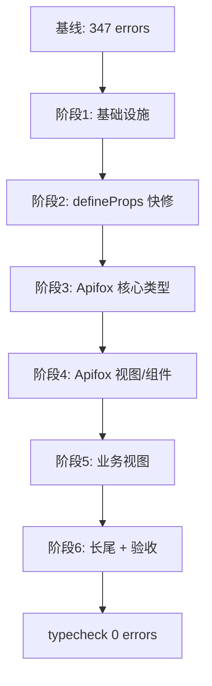

# 前端 TS 类型补全执行计划

## 现状基线

- 命令：[`frontend/package.json`](frontend/package.json) 中 `pnpm typecheck`（`vue-tsc --noEmit`）
- 当前错误：**347 个**（[`frontend/tsconfig.json`](frontend/tsconfig.json) 已 `strict: true`）
- pre-push 钩子：[`.husky/pre-push`](frontend/.husky/pre-push) 会阻塞 push

| 错误码 | 数量 | 典型原因 |
|--------|------|----------|
| TS2345 | 131 | 参数类型不匹配（路由 param、API payload、组件 props） |
| TS7006 | 57 | 回调/参数隐式 `any` |
| TS2322 | 52 | 赋值/绑定类型不兼容 |
| TS18048 | 38 | 可能为 `undefined` |
| TS2339 | 33 | 访问不存在的属性 |
| TS2304 | 10 | 未定义标识符（几乎全是 `props`） |

**错误最集中的文件（Top 10）：**

- [`views/apifox/sections/ApiManage.vue`](frontend/src/views/apifox/sections/ApiManage.vue) — 29
- [`views/TestCases.vue`](frontend/src/views/TestCases.vue) — 27
- [`views/apifox/sections/ScenarioPanel.vue`](frontend/src/views/apifox/sections/ScenarioPanel.vue) — 27
- [`views/apifox/sections/SuitePanel.vue`](frontend/src/views/apifox/sections/SuitePanel.vue) — 26
- [`components/apifox/ScenarioStepRow.vue`](frontend/src/components/apifox/ScenarioStepRow.vue) — 22
- [`components/apifox/ScenarioStepDetail.vue`](frontend/src/components/apifox/ScenarioStepDetail.vue) — 21
- [`views/Requirements.vue`](frontend/src/views/Requirements.vue) — 21
- [`components/apifox/ScenarioStepsEditor.vue`](frontend/src/components/apifox/ScenarioStepsEditor.vue) — 17
- [`components/apifox/ApiDebugPanel.vue`](frontend/src/components/apifox/ApiDebugPanel.vue) — 14
- [`components/apifox/EndpointCasesTab.vue`](frontend/src/components/apifox/EndpointCasesTab.vue) — 12



---

## 阶段 0：开工前快照（约 10 分钟）

1. 在 `frontend/` 执行 `pnpm typecheck 2>&1 | tee typecheck-baseline.txt`，保存错误清单供 diff 对比。
2. 记录各阶段结束后的剩余错误数，便于评估进度。

**验收：** 有 baseline 文件；不改动业务代码。

---

## 阶段 1：公共类型基础设施（预计消除 ~80–100 个错误）

### 1.1 路由参数：`useRouteParamId`

**问题：** 大量文件使用 `computed(() => route.params.projectId)`，类型为 `string | string[]`，无法传给期望 `Id`（`number | string`）的 store/API/composable。

**方案：** 新增 [`frontend/src/composables/useRouteParamId.ts`](frontend/src/composables/useRouteParamId.ts)：

```ts
import { computed, type ComputedRef } from 'vue'
import { useRoute } from 'vue-router'
import type { Id } from '@/api/request'

export function useRouteParamId(name = 'projectId'): ComputedRef<Id> {
  const route = useRoute()
  return computed(() => {
    const raw = route.params[name]
    return Array.isArray(raw) ? raw[0]! : raw
  })
}
```

**批量替换范围（约 15 处）：**  
`ApiManage.vue`、`ScenarioPanel.vue`、`SuitePanel.vue`、`ProjectWorkspace.vue`、`EnvManage.vue`、`SchemaManage.vue`、`DatasetPanel.vue`、`SchedulePanel.vue`、`RunReports.vue`、`ProjectSettings.vue`、`AutoTests.vue`、`CaseEditor.vue`、`RunProgress.vue`、`ScenarioStepDetail.vue` 等。

> 不在 script 中直接解构 `route.params`；统一走 composable，避免 `string[]` 泄漏。

### 1.2 扩展 router 类型（可选增强）

在 [`frontend/src/types/router.d.ts`](frontend/src/types/router.d.ts) 现有 `RouteMeta` 扩展之外，**不引入** `unplugin-vue-router`（改动面过大）；仅文档化「动态段一律用 `useRouteParamId`」。

### 1.3 统一 `Id` 类型出口

- 现状：`Id` 在 [`api/request.ts`](frontend/src/api/request.ts) 与 [`types/common.ts`](frontend/src/types/common.ts) 重复定义。
- **方案：** `types/common.ts` 改为 `export type { Id } from '@/api/request'`，全项目只保留一处定义。

### 1.4 Element Plus 表单校验类型

已有 [`types/element-plus.ts`](frontend/src/types/element-plus.ts) 导出 `FormRuleItem`。  
在 `UserManagement.vue`、`Requirements.vue` 等表单校验中统一使用：

```ts
import type { FormRuleItem } from '@/types/element-plus'

const rules = {
  username: [
    { required: true, message: '...' },
    {
      validator: (_rule: FormRuleItem, value: string, callback: (err?: Error) => void) => { ... },
      trigger: 'blur',
    },
  ],
}
```

**验收：** 跑 `pnpm typecheck`，TS2345 中 route 相关条目应显著下降。

---

## 阶段 2：`defineProps` 快修（预计消除 ~10–20 个错误）

**问题：** script 内引用 `props.xxx`，但 `withDefaults(defineProps(...))` 未赋值给 `const props`。

**必改文件（已确认）：**

| 文件 | 现状 |
|------|------|
| [`ApiDebugPanel.vue`](frontend/src/components/apifox/ApiDebugPanel.vue) | `withDefaults(...)` 无赋值，10 处 TS2304 |
| [`CaseEditor.vue`](frontend/src/components/apifox/CaseEditor.vue) | 同上模式 |
| [`ScenarioRunConfigBar.vue`](frontend/src/components/apifox/ScenarioRunConfigBar.vue) | 同上 |
| [`PageCard.vue`](frontend/src/components/PageCard.vue) | 同上 |
| [`VariableTable.vue`](frontend/src/components/apifox/VariableTable.vue) | 同上 |
| [`RunningAutomations.vue`](frontend/src/components/apifox/workbench/RunningAutomations.vue) | 同上 |
| [`RecentReports.vue`](frontend/src/components/apifox/workbench/RecentReports.vue) | 同上 |

**规范（写入团队约定）：**

```ts
const props = withDefaults(defineProps<{ ... }>(), { ... })
// 若 script 不用 props，可省略赋值；template 仍可直接用 prop 名
```

**验收：** TS2304 归零。

---

## 阶段 3：Apifox 领域类型对齐（预计消除 ~100–120 个错误）

### 3.1 接口表单：`EndpointForm` vs `EndpointEditorForm`

**问题：** [`stores/apiTabs.ts`](frontend/src/stores/apiTabs.ts) 的 `EndpointForm`（含 `id`、`unknown[]`）与 [`ApiEndpointEditor.vue`](frontend/src/components/apifox/ApiEndpointEditor.vue) 导出的 `EndpointEditorForm`（OpenAPI `Schemas` 类型）不一致，导致 `ApiManage`、`ApiDebugPanel`、`ApiDocPreview` 等 TS2322/TS2345。

**方案（推荐）：**

1. 在 [`types/apifox.ts`](frontend/src/types/apifox.ts) 新增 **`EndpointEditorForm`**（从 ApiEndpointEditor 迁出，作为单一来源）。
2. `apiTabs.ts` 中 `EndpointForm = EndpointEditorForm & { id: number }`。
3. `assertions`/`extracts`/`pre_scripts`/`post_scripts` 改用 `Schemas['AssertionRow']` 等，去掉 `unknown[]`。
4. `ApiEndpointEditor.vue` 改为从 `types/apifox` re-export，避免 `.vue` 文件作类型源。

### 3.2 场景步骤：`ScenarioEditorStep`

**问题：** `ScenarioEditorStep` 在 `ScenarioStepRow.vue` 本地定义，`ScenarioStepDetail`/`ScenarioStepsEditor`/`ScenarioPanel` 各自扩展，导致 children/elseChildren/_uid 等 TS2339。

**方案：**

1. 在 `types/apifox.ts` 集中定义：

```ts
import type { Schemas } from '@/api/types'

export type ScenarioEditorStep = Schemas['StepOut'] & {
  _uid: number
  elseChildren?: ScenarioEditorStep[]
  elseEnabled?: boolean
}
```

2. 三个组件统一 import；递归类型用 `type` 别名（避免 interface 交叉限制）。
3. 步骤树初始化/序列化 helper（若已有 util）补返回类型 `ScenarioEditorStep[]`。

### 3.3 Store / Composable 签名收紧

- [`stores/apiTabs.ts`](frontend/src/stores/apiTabs.ts)、[`stores/scenarioTabs.ts`](frontend/src/stores/scenarioTabs.ts)、[`stores/suiteTabs.ts`](frontend/src/stores/suiteTabs.ts)：pid 参数统一 `Id`。
- [`composables/useProjectScripts.ts`](frontend/src/composables/useProjectScripts.ts)：`Ref<Id | null | undefined>` 与 route composable 对齐。

**验收：** Scenario 相关 5 个 Top 文件错误应减半以上；ApiManage 中 form 绑定错误清除。

---

## 阶段 4：Apifox 视图与组件扫尾（预计消除 ~60–80 个错误）

按文件逐个清零（每改 2–3 个文件跑一次 typecheck）：

**高优先级 section（各 5–29 errors）：**

- [`ApiManage.vue`](frontend/src/views/apifox/sections/ApiManage.vue) — `@tab-change` 回调参数标注 `TabPaneName`；`activeTab` 空值守卫；接入阶段 1/3 类型
- [`ScenarioPanel.vue`](frontend/src/views/apifox/sections/ScenarioPanel.vue) / [`SuitePanel.vue`](frontend/src/views/apifox/sections/SuitePanel.vue) — tab store + 步骤编辑器类型
- [`SchedulePanel.vue`](frontend/src/views/apifox/sections/SchedulePanel.vue)、[`EnvManage.vue`](frontend/src/views/apifox/sections/EnvManage.vue)、[`SchemaManage.vue`](frontend/src/views/apifox/sections/SchemaManage.vue)、[`DatasetPanel.vue`](frontend/src/views/apifox/sections/DatasetPanel.vue)、[`RunReports.vue`](frontend/src/views/apifox/sections/RunReports.vue)、[`ProjectSettings.vue`](frontend/src/views/apifox/sections/ProjectSettings.vue)

**组件簇：**

- [`EndpointCasesTab.vue`](frontend/src/components/apifox/EndpointCasesTab.vue)、[`ScenarioListPanel.vue`](frontend/src/components/apifox/ScenarioListPanel.vue)、[`ImportDiffPreview.vue`](frontend/src/components/apifox/ImportDiffPreview.vue)、[`KvRowsEditor.vue`](frontend/src/components/apifox/KvRowsEditor.vue)、[`DataDriveEditor.vue`](frontend/src/components/apifox/DataDriveEditor.vue)、[`AiGenerateCasesDialog.vue`](frontend/src/components/apifox/AiGenerateCasesDialog.vue)

**常见修复模式：**

| 模式 | 处理方式 |
|------|----------|
| TS18048 ref 可能 undefined | `if (!x.value) return` 或 `x.value?.method()` |
| el-table 行回调 | `(row: TestCase) => ...` |
| API 响应分页 | 用 `PageResult<T>` / `ProjectPage`（[`types/common.ts`](frontend/src/types/common.ts)）区分「数组 vs 分页对象」 |
| `config?: Record<string, unknown>` | 窄化断言或 typed config interface |

**验收：** apifox 目录剩余错误 < 30。

---

## 阶段 5：非 apifox 业务视图（预计消除 ~60 个错误）

| 文件 | 重点 |
|------|------|
| [`TestCases.vue`](frontend/src/views/TestCases.vue) | 为 table/批量审批/export/import 回调补 `TestCase`、`ReviewStatus` 类型；修复 TS7053 索引签名 |
| [`Requirements.vue`](frontend/src/views/Requirements.vue) | 同上 + 表单 model 对齐 `Schemas['RequirementCreate']` |
| [`TestExecution.vue`](frontend/src/views/TestExecution.vue) | `currentCase` null 守卫；`projects` 赋值区分 `ProjectPageOut` vs `Project[]` |
| [`UserManagement.vue`](frontend/src/views/UserManagement.vue) | 校验器类型；创建用户 payload 补 `role` 字段 |
| [`RequirementDocs.vue`](frontend/src/views/RequirementDocs.vue)、[`layouts/MainLayout.vue`](frontend/src/layouts/MainLayout.vue) | 长尾 TS2339/TS2345 |

**ReviewStatus 建议：** 在 `types/common.ts` 增加 string union：

```ts
export type ReviewStatus = 'draft' | 'pending' | 'approved' | 'rejected'
```

**验收：** 业务 views 目录错误归零。

---

## 阶段 6：长尾清理、遗留 JS、最终验收

### 6.1 清零剩余错误

- 对 `pnpm typecheck` 输出做最后一次 grep，按文件逐个处理 TS2769/TS2741 等个位数错误。
- 目标：**0 errors**。

### 6.2 遗留 `.js` 文件（非 typecheck 阻塞，但建议同期清理）

`src/` 下仍有约 25 个与 `.ts` 并存的 `.js`（如 `main.js`、`stores/apiTabs.js`）。  
[`index.html`](frontend/index.html) 已指向 `main.ts`，但并存文件易误导后续开发。

**方案：** 确认 `.ts` 版本完整后删除对应 `.js` 副本（单独 commit：`chore(frontend): 移除 TS 迁移遗留 .js 副本`）。

### 6.3 验收清单

- [ ] `cd frontend && pnpm typecheck` 退出码 0
- [ ] `pnpm lint` 无新增 error
- [ ] `pnpm build` 成功
- [ ] git push **不**使用 `--no-verify`，pre-push typecheck 通过
- [ ] 手动冒烟：登录 → Dashboard → `/apifox/project/:id/apis` 打开接口 → 场景/套件编辑 → TestCases 列表

### 6.4 文档（轻量）

在 [`CLAUDE.md`](CLAUDE.md) 前端章节追加 3 条 TS 约定（不新建独立 md）：

1. 路由动态参数用 `useRouteParamId`
2. script 引用 props 必须 `const props = defineProps/withDefaults(...)`
3. Apifox UI 类型优先放 `types/apifox.ts`，API 类型用 `Schemas['...']`

---

## 推荐执行顺序与 PR 策略

| 批次 | 内容 | 预估剩余错误 |
|------|------|-------------|
| PR-1 | 阶段 1 + 2（基础设施 + defineProps） | ~250 |
| PR-2 | 阶段 3（Apifox 领域类型） | ~130 |
| PR-3 | 阶段 4（Apifox 视图扫尾） | ~50 |
| PR-4 | 阶段 5 + 6（业务视图 + 验收 + 删 .js） | 0 |

每批合并前必须在本地 `pnpm typecheck` 通过；避免「全量改完再编译」难以定位回归。

---

## 风险与注意事项

1. **不要放宽 tsconfig**：不改为 `strict: false` 或关 `noImplicitAny`；用类型补全而非降级。
2. **OpenAPI 类型优先**：业务实体优先 `Schemas['XxxOut']`，UI 扩展放 `types/apifox.ts`，避免在 `.vue` 中 export type。
3. **最小 diff**：同一文件内聚修复，不顺手改 UI/逻辑；类型断言（`as`）仅用于第三方库边界，业务数据尽量 structurally typed。
4. **409 冲突逻辑**：apifox 保存冲突处理（[`useSaveConflict.ts`](frontend/src/composables/useSaveConflict.ts)）改类型时不要动行为。
