# AI 测试平台

演示地址：http://43.160.226.39:5173/login

基于 **Python FastAPI + Vue 3** 的智能质量与测试管理平台，覆盖需求管理、功能用例、AI 生成、手工执行与 **Apifox 式接口自动化**（`apifox` 模块）。

## 界面预览

截图存放在仓库 [`images/`](./images/) 目录（随库提交，供 README / 对外介绍引用）。

### 平台入口与工作台

| 说明 | 截图 |
|------|------|
| 登录页 | 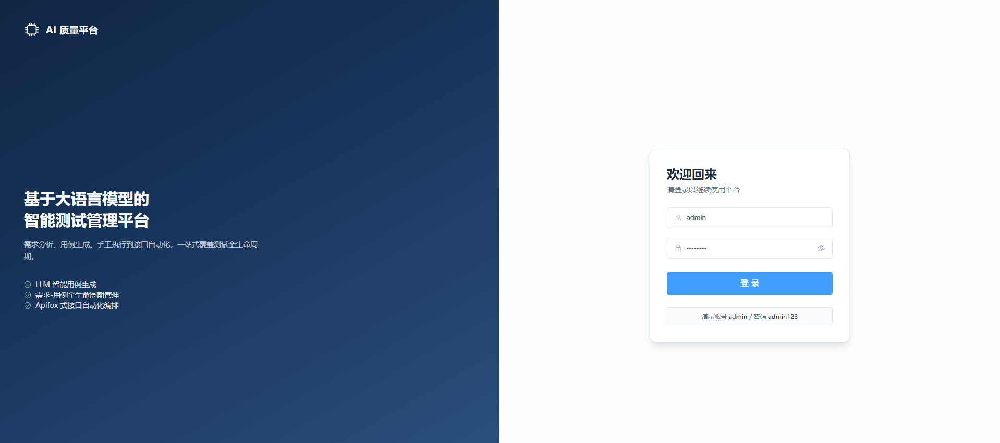 |
| 首页：需求 → 用例 → 执行 → 自动化全链路 | 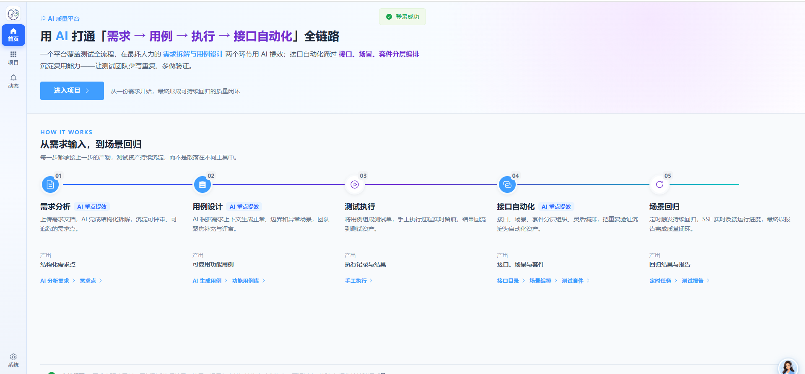 |
| 项目列表、置顶/搜索、右侧活动（失败聚焦 / 报告 / 定时 / 手工） | 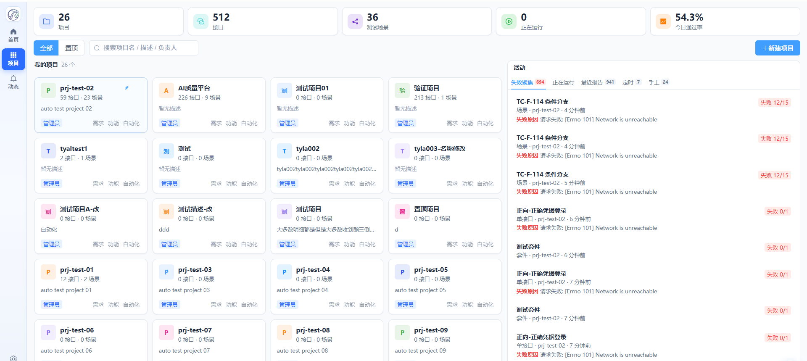 |

### 需求域

| 说明 | 截图 |
|------|------|
| 需求概览与推荐工作流 | 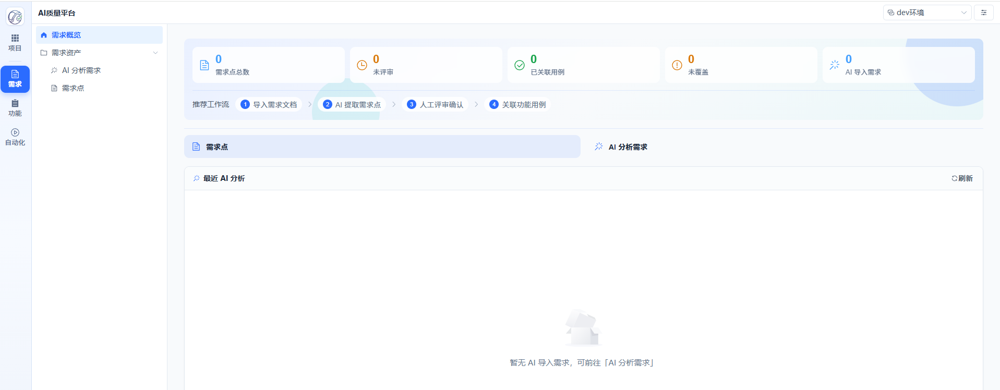 |
| AI 分析需求（上传文档 → 解析 → 导入需求点） | 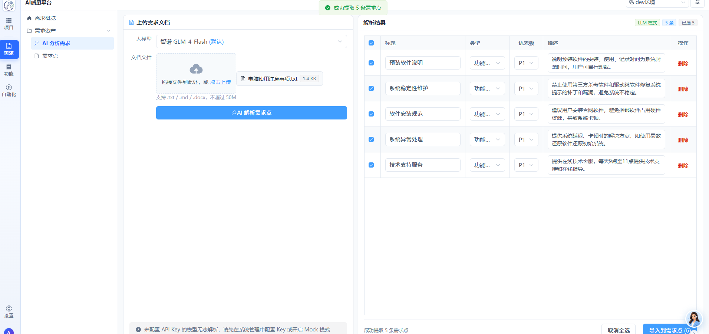 |
| 需求点列表（评审状态、关联用例） | 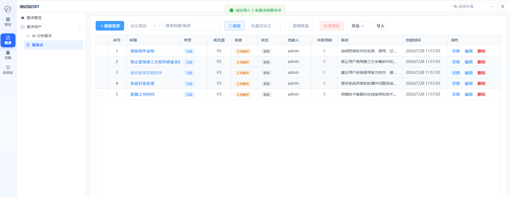 |

### 功能测试

| 说明 | 截图 |
|------|------|
| AI 生成功能用例（关联需求点、流式生成） | 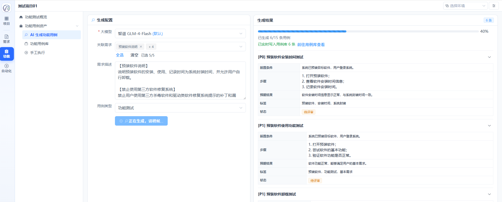 |
| 功能用例库（评审、批量操作） | 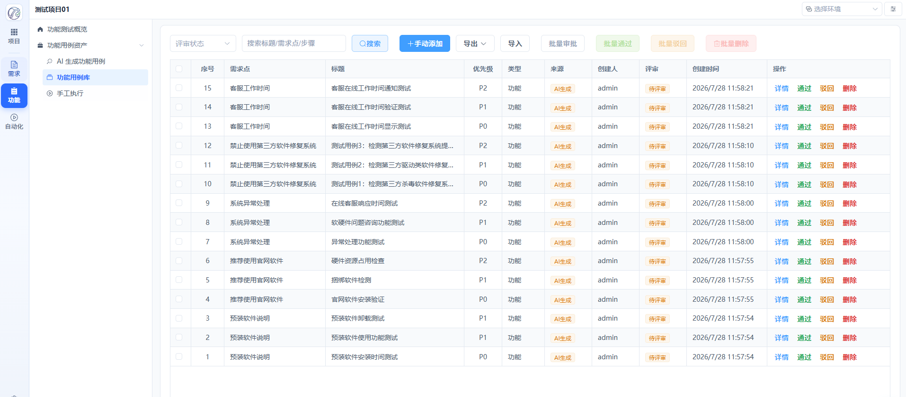 |
| 手工执行（禅道式用例执行与结果录入） | 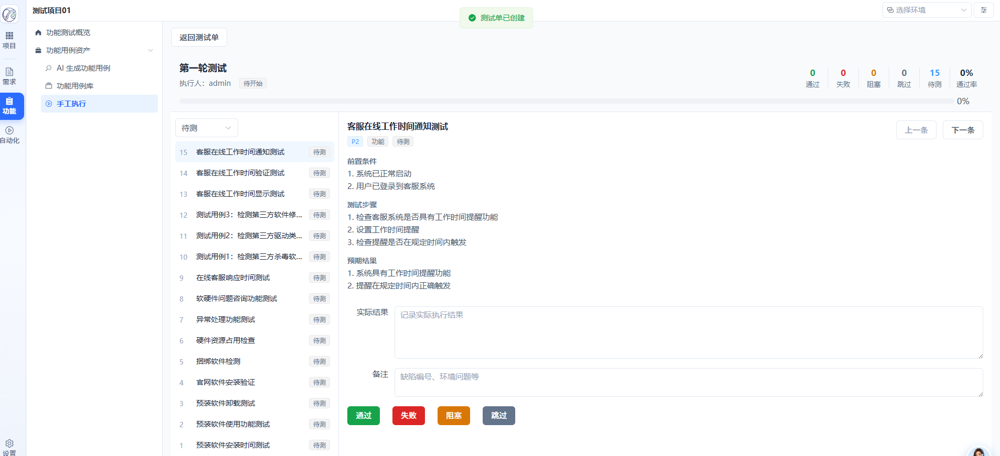 |

### 接口自动化（apifox）

| 说明 | 截图 |
|------|------|
| 自动化概览（指标、近 7 天通过率、最近执行） | 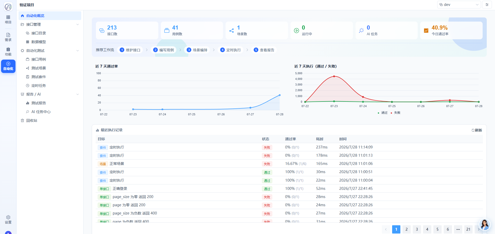 |
| 接口目录与调试（Params / Body / 前后置） | 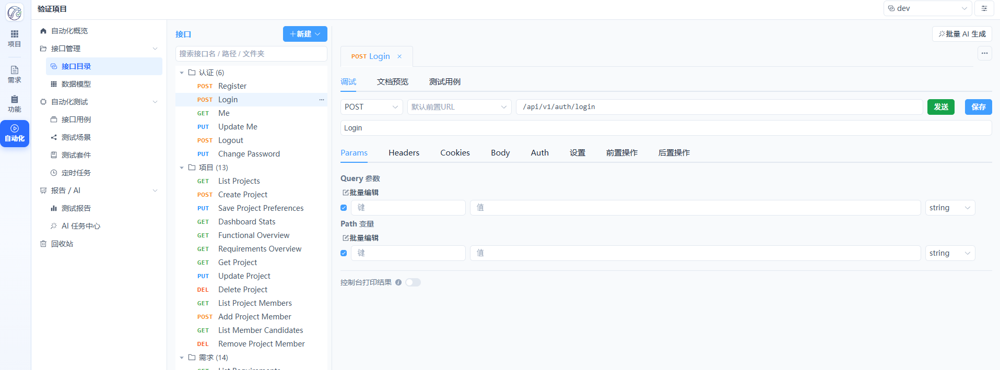 |
| 数据模型（可视化字段编辑） | 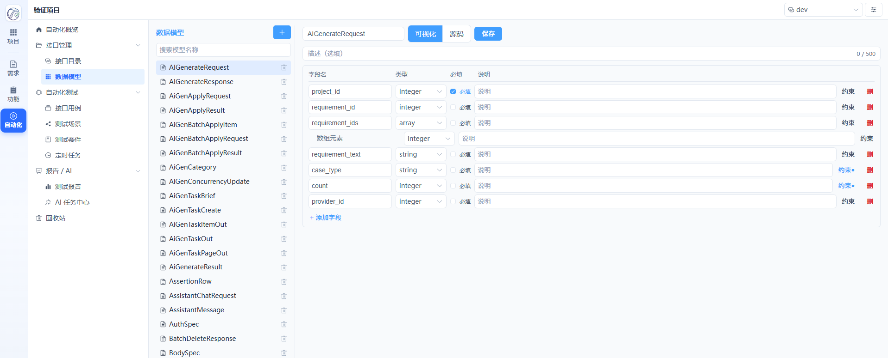 |
| 接口用例（分类筛选、AI 生成、运行） | 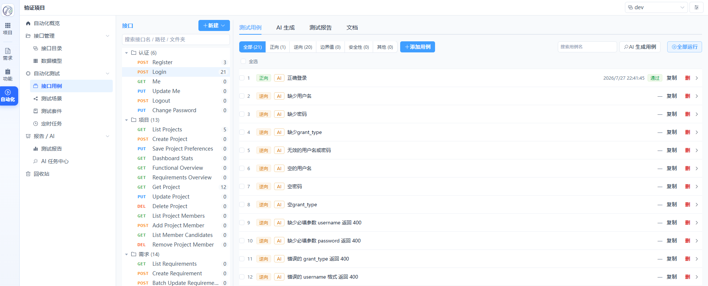 |
| 测试场景（步骤编排与运行） | 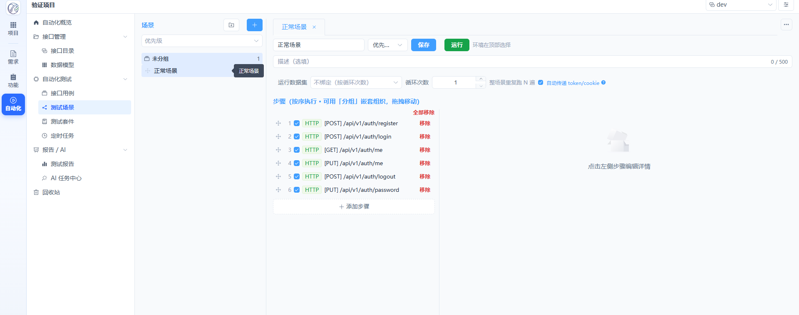 |
| 测试套件（引用用例 / 场景） | 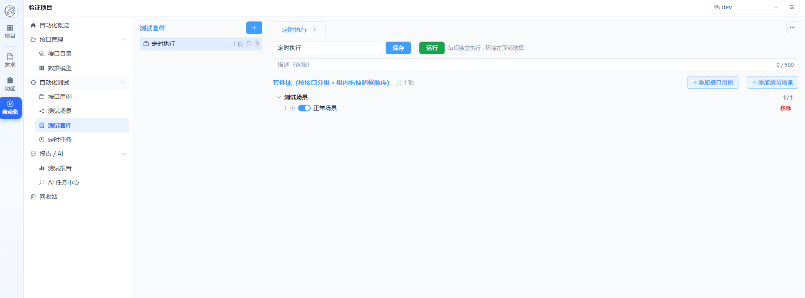 |
| 定时任务 | 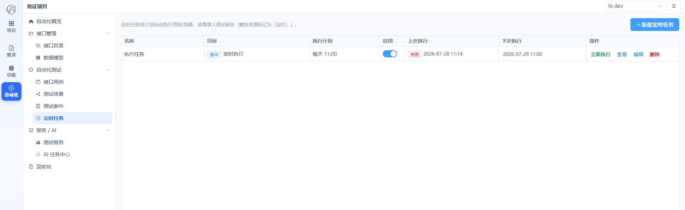 |
| 测试报告详情（步骤级断言与请求回溯） | 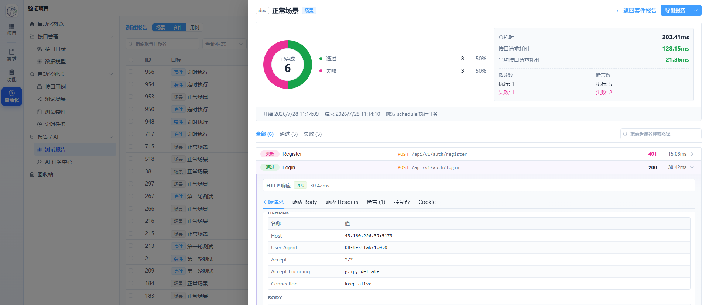 |

> 目录中另有历史截图 `Snipaste_01.png` … `Snipaste_16.png`；**新版介绍以 `1.png`–`17.png` 为准**。

## 功能模块

| 域 | 模块 | 说明 |
|----|------|------|
| **工作台** | 首页 / 项目列表 | 项目置顶、最近动态、快捷入口 |
| **需求** | 需求文档、需求点 | 文档解析、需求点维护与追溯 |
| **功能测试** | 用例库、AI 生成、手工执行 | 评审、Excel 导出、测试单执行与分页列表 |
| **自动化** | 接口管理、用例/场景/套件 | Apifox 风格调试、分层目录、Monaco 脚本 |
| **自动化** | 测试报告、定时任务、AI 任务 | SSE 执行进度、报告导出、调度与接口 AI 生成 |
| **自动化** | 项目设置 | 环境、成员、导入导出、数据集、回收站等 |
| **系统** | 用户 / 部门 / 权限 / LLM | JWT、菜单权限、多 Provider LLM 配置 |

> 旧版 `api_automation` 模块已下线；接口自动化统一为 **`apifox`**（API 前缀 `/api/v1/apifox/*`）。菜单权限键仍可见 `api_automation` 命名，对应 apifox 能力。

### 接口自动化（apifox）要点

- **分层**：`routers` → `services` → `repositories` → `models`（表前缀 `apifox_`）
- **调试**：Header / Query / Path / Body、认证、前后置脚本（JS/Python）、断言与变量提取
- **组织**：接口目录树、单接口用例、测试场景、测试套件（套件项可引用用例/场景）
- **执行**：场景/套件/用例运行，**SSE** 推送进度；报告支持 Excel / Word / PDF / JSON
- **定时任务**：按天/周/间隔/Cron 调度，结果写入测试报告（触发来源「定时」）
- **AI**：单接口/批量生成用例、任务中心、入库/废弃与回收站
- **协作**：乐观锁（冲突 HTTP 409）、项目隔离、OpenAPI 导入、定时导入等

## 技术栈

| 层 | 技术 |
|----|------|
| 后端 | FastAPI、SQLAlchemy、MySQL、JWT、httpx、pytest、ruff |
| 前端 | Vue 3、TypeScript、Vite、Element Plus、Pinia、pnpm、vue-tsc、ESLint 9 + Prettier |
| AI | OpenAI 兼容 Chat Completions（可 Mock；系统设置多 Provider 优先于环境变量） |
| 部署 | Docker Compose、Nginx 静态资源 + 反代 `/api` |
| 可观测 | 可选 Grafana + Loki（`monitoring/`、`WITH_MONITORING=1`） |

## 项目结构

```
testhub/
├── backend/                    # FastAPI 后端
│   ├── app/
│   │   ├── main.py             # 入口、路由注册、lifespan（bootstrap + 定时调度）
│   │   ├── routers/            # HTTP 层（含 routers/apifox/* 与 test_execution 等）
│   │   ├── services/           # 业务逻辑（含 services/apifox/ 执行引擎、AI、调度等）
│   │   ├── repositories/       # 数据访问（apifox 子包）
│   │   ├── models/             # SQLAlchemy 模型（含 models/apifox/）
│   │   └── schemas.py          # 通用 Pydantic 模型
│   ├── tests/                  # pytest 主目录（apifox / 助手等）
│   ├── requirements.txt
│   └── pyproject.toml          # ruff / mypy / pytest 配置
├── frontend/                   # Vue 3 前端
│   ├── src/
│   │   ├── layouts/            # HubHomeShell、ProjectShell、SystemShell 等
│   │   ├── views/hub/          # 首页、项目列表
│   │   ├── views/apifox/       # 自动化工作区（sections 各面板）
│   │   ├── components/apifox/  # 接口编辑器、运行报告、导入树等
│   │   ├── components/shell/   # 工作区导航树、域概览
│   │   ├── api/                # axios 封装 + OpenAPI 生成类型 schema.d.ts
│   │   ├── router/             # 路由与权限守卫
│   │   ├── stores/             # user、workspace、aiGenerate 等
│   │   └── composables/        # 深链 hash、导入树、保存冲突等
│   ├── docs/                   # 前端开发规范
│   └── package.json            # 包管理器：pnpm
├── docker/                     # MySQL 初始化等
├── monitoring/                 # Grafana / Loki Compose 与仪表盘
├── scripts/                    # 备份等运维脚本
├── docs/                       # 产品/规格说明（部分）
├── .claude/                    # AI 规则、技能、脚本（与 Cursor 共用规范）
├── images/                     # 产品截图（README 界面预览：1.png–17.png）
├── docker-compose.yml
├── .env.docker.example
├── deploy.sh                   # 本地开发 / docker 快捷命令
├── linux-deploy.sh             # Linux Docker 一键部署（推荐生产）
├── install-server.sh           # 远程克隆 + 部署
├── update.sh                   # git pull + 重新部署
├── CLAUDE.md                   # AI 与开发者速查（命令、架构）
└── README.md
```

## 环境要求

**方式一：Docker 部署（推荐，无需本地 Python/Node/MySQL）**

- Docker 20.10+
- Docker Compose 插件 v2+

**方式二：传统本地开发（Linux / macOS / WSL）**

- Python 3.12+（与 `pyproject.toml` 一致）
- Node.js 18+，**pnpm**（`corepack enable pnpm`）
- MySQL 8.0+（或 Docker 仅起 MySQL）

## 快速启动

### 本地开发

```bash
chmod +x deploy.sh
./deploy.sh          # 安装依赖并启动开发环境
./deploy.sh stop
./deploy.sh restart
./deploy.sh status
./deploy.sh prod     # 构建前端 + 生产模式后端
./deploy.sh docker up
```

**手动启动：**

```bash
# 后端
cd backend
pip install -r requirements.txt   # 复制 .env.example → .env
uvicorn app.main:app --reload --host 0.0.0.0 --port 8000

# 前端
cd frontend
pnpm install
pnpm dev                          # http://127.0.0.1:5173
```

| 服务 | 地址 |
|------|------|
| 前端 | http://127.0.0.1:5173 |
| 后端 API | http://127.0.0.1:8000 |
| Swagger | http://127.0.0.1:8000/docs |

**演示账号：** `admin` / `admin123`

> 开发时 Vite 将 `/api` 代理到 `frontend/vite.config.ts` 中的 target；联调本机后端请改为 `http://127.0.0.1:8000`（勿提交该改动，见 `CLAUDE.local.md`）。

### Linux 一键部署（生产）

```bash
cp .env.docker.example .env.docker   # 修改 MYSQL_ROOT_PASSWORD、DB_PASSWORD 等
chmod +x linux-deploy.sh
./linux-deploy.sh
```

远程首次安装：

```bash
PUBLIC_HOST=你的公网IP INSTALL_DIR=/opt/testhub ./install-server.sh
```

常用命令：

```bash
./linux-deploy.sh status
./linux-deploy.sh logs backend
./linux-deploy.sh restart
./linux-deploy.sh stop
bash update.sh
WITH_MONITORING=1 ./linux-deploy.sh up
./linux-deploy.sh backup-db
./linux-deploy.sh restore-db <文件>
```

服务架构：`frontend (Nginx)` → 反代 `/api` → `backend (FastAPI)` → `mysql`

**`.env.docker` 常用项：**

| 变量 | 说明 |
|------|------|
| `HTTP_PORT` | 前端 Nginx 端口（默认 5173） |
| `BACKEND_PORT` | 后端 API 端口（默认 8000） |
| `MYSQL_PORT` | MySQL 映射端口（默认 **3245**） |
| `MYSQL_PUBLISH_HOST` | 绑定地址（`0.0.0.0` 允许远程；仅隧道用 `127.0.0.1`） |
| `MYSQL_ROOT_PASSWORD` / `DB_PASSWORD` | 须强密码 |
| `SECRET_KEY` | JWT 密钥 |
| `LLM_API_KEY` | 留空则 Mock |

**MySQL 远程（Navicat 等）：** 主机=服务器 IP，端口=`MYSQL_PORT`，库=`ai_testcase`，用户=`ai_testcase`；云安全组需放行对应 TCP 端口。若出现 **`RECOVER_YOUR_DATA`** 勒索库，说明实例曾暴露弱口令——改强密码、收紧入站、从 `backup-db` 备份恢复或 `fix-db` 重建，勿付赎金。

**生产访问（默认端口）：**

| 服务 | 地址 |
|------|------|
| 前端 | http://服务器IP:5173 |
| Swagger | http://服务器IP:5173/docs |
| Grafana（可选） | http://服务器IP:3000 |

### 数据库备份

备份目录默认 **`/opt/ai-platform-backups/mysql/`**（`BACKUP_DIR` 可配置）。

| 命令 | 说明 |
|------|------|
| `./linux-deploy.sh backup-db` | 立即备份 |
| `./linux-deploy.sh backup-list` | 列出备份 |
| `./linux-deploy.sh backup-setup-cron` | 安装每日自动备份 |
| `./linux-deploy.sh restore-db <文件>` | 恢复 |

自定义每日备份时间：`BACKUP_CRON_HOUR=2 BACKUP_CRON_MINUTE=30 ./linux-deploy.sh backup-setup-cron`。日志默认 `/opt/ai-platform-backups/backup.log`。

## 配置说明

`backend/.env`（由 `.env.example` 复制）：

```env
SECRET_KEY=change-this-to-a-random-secret-key
DB_HOST=127.0.0.1
DB_PORT=3306
DB_USER=root
DB_PASSWORD=your-password
DB_NAME=ai_testcase

LLM_API_BASE=https://api.openai.com/v1
LLM_API_KEY=
LLM_MODEL=gpt-4o-mini
LLM_MOCK_MODE=true
```

Docker 环境变量见 **`.env.docker.example`**（`HTTP_PORT`、`BACKEND_PORT`、`MYSQL_PORT` 默认 3245 等）。

## 前端路由（v2 壳）

业务入口以 **`/hub`** 为主；项目内能力在 **`/hub/workspace/:projectId`**，子页面通过 **URL hash** 切换（非大量独立 path）：

| Hash 示例 | 含义 |
|-----------|------|
| `#domain=requirements&section=req-points` | 需求点 |
| `#domain=functional&section=func-cases` | 功能用例 |
| `#domain=functional&section=func-runs` | 手工执行（测试单） |
| `#domain=automation&biz=apis&section=apis` | 接口管理 |
| `#domain=automation&biz=autotest&section=schedules` | 定时任务 |
| `#domain=automation&biz=reports&section=reports` | 测试报告 |
| `#domain=automation&biz=reports&section=reports&run=123` | 报告详情（全页，深链） |
| `#domain=settings&open=envs` | 项目环境设置 |

旧路径（如 `/dashboard`、`/apifox/project/:id`）会 **redirect** 到新壳。

系统管理：`/system/settings`、`/system/users` 等（`SystemShell`）。

## API 前缀

统一：**`/api/v1`**

| 分组 | 说明 |
|------|------|
| `/auth`、`/projects`、`/requirements`、`/testcases` | 认证与需求/功能用例 |
| `/test-executions` | 手工测试单（含 `/page` 分页） |
| `/users`、`/departments`、`/settings` | 系统与用户 |
| `/apifox/projects/{pid}/*` | 接口、用例、场景、套件、环境等 |
| `/apifox/runs/*`、`/apifox/schedules/*` | 运行记录与定时任务 |
| `/apifox/workbench/*` | 工作台聚合（运行中、报告、定时等） |
| `/assistant` | 助手动作 |

OpenAPI：`backend/openapi.json`；前端类型：`pnpm gen:api-types`。

## 开发与质量

```bash
# 后端
cd backend
python -m pytest
ruff check app

# 前端
cd frontend
pnpm lint
pnpm typecheck
pnpm build
```

更完整的命令、分层约定与 Git/Spec 工作流见仓库根目录 **`CLAUDE.md`** 与 **`.claude/rules/`**。

## 许可证

内部项目，按需自行维护与部署。
